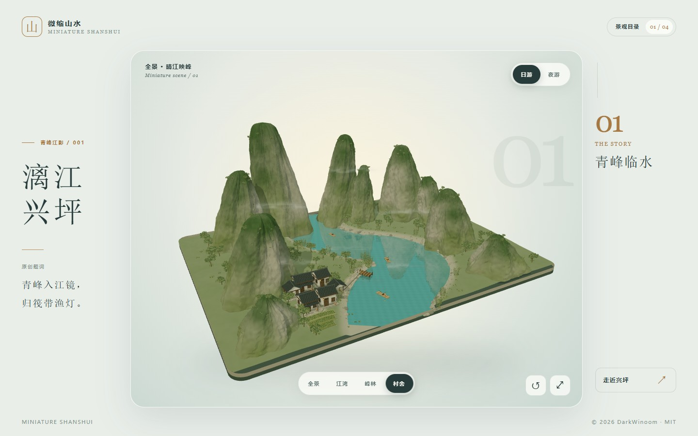
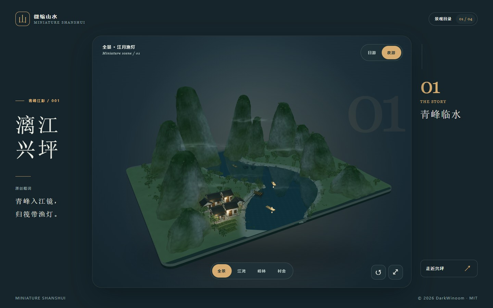
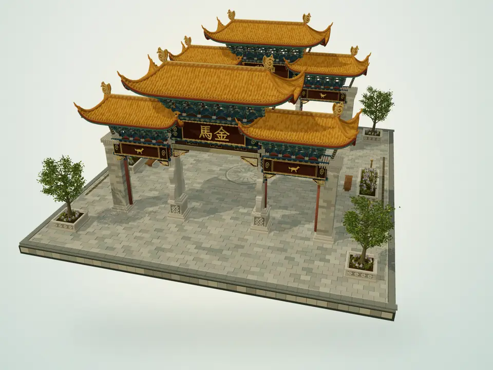
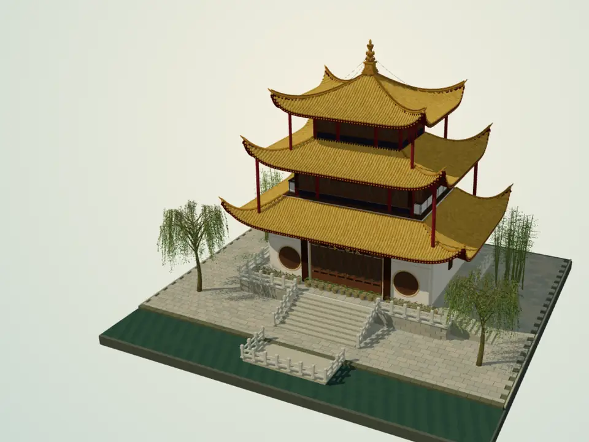
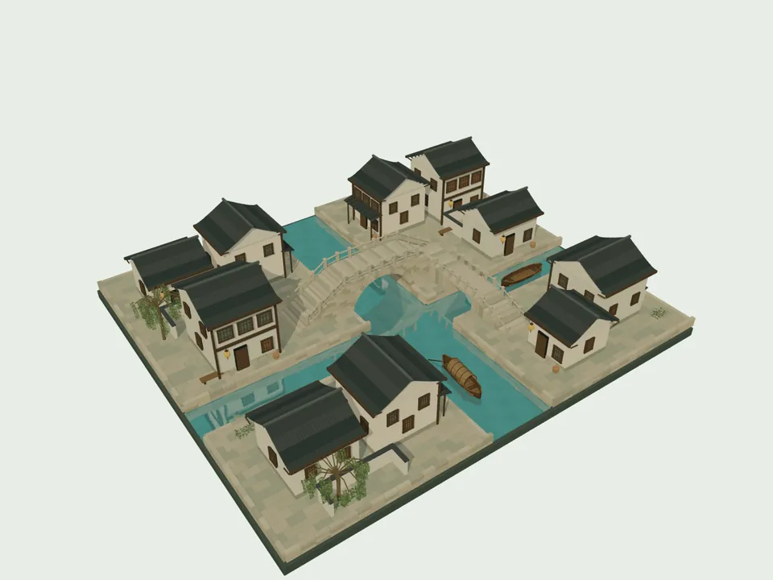

# 微缩山水

从漓江兴坪到周庄双桥，在浏览器里转动一方微缩景观。项目是纯前端单页应用，无账号、后端或外部数据服务。

## 页面预览

| 日游 | 夜游 |
| :---: | :---: |
|  |  |

## 其他景观

| 金马碧鸡坊 | 大观楼 | 周庄双桥 |
| :---: | :---: | :---: |
| 昆明双坊相望，金瓦、青绿斗拱与石柱勾勒出街口风景。 | 滇池畔的三重檐楼阁，黄瓦、回廊与长联映出湖山意趣。 | 两桥相接、水巷交汇，粉墙灰瓦与临水民居组成江南微景。 |
|  |  |  |

## 本地运行

需要 Node.js 24 和 pnpm 11.19.0。下载仓库后，在项目根目录运行：

```sh
npm install --global pnpm@11.19.0
pnpm install --frozen-lockfile
pnpm dev
```

打开终端给出的本地地址。检查和构建生产文件：

```sh
pnpm check
pnpm build
pnpm preview
```

构建结果位于 `dist/`。也可以用 `npm install`、`npm run dev` 和 `npm run build`；仓库以 pnpm 锁文件作为可复现安装基准。

## 部署

运行 `pnpm build` 后，把 **`dist/` 内的全部文件** 放到任意静态网站服务的站点目录。资源使用相对路径，放在站点根目录或子目录均可。无需配置 API、数据库或服务端路由。直接双击本地 `index.html` 不适合加载模型，请通过静态服务器访问。

若使用 Docker，项目提供只构建前端并由 Nginx 提供静态文件的多阶段镜像：

```sh
docker build -t miniature-shanshui .
docker run --rm -p 8080:80 miniature-shanshui
```

然后访问 [http://localhost:8080](http://localhost:8080)。

## 内容与许可

项目采用 [MIT License](LICENSE)。模型创作说明、资料来源与第三方许可见 [内容与许可](docs/CONTENT-LICENSE.md)。
