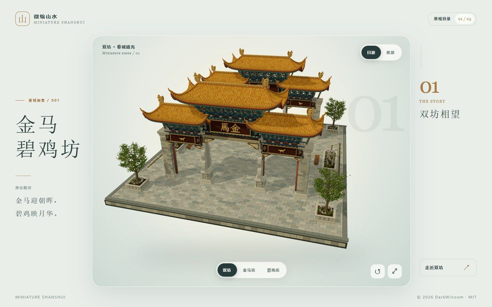
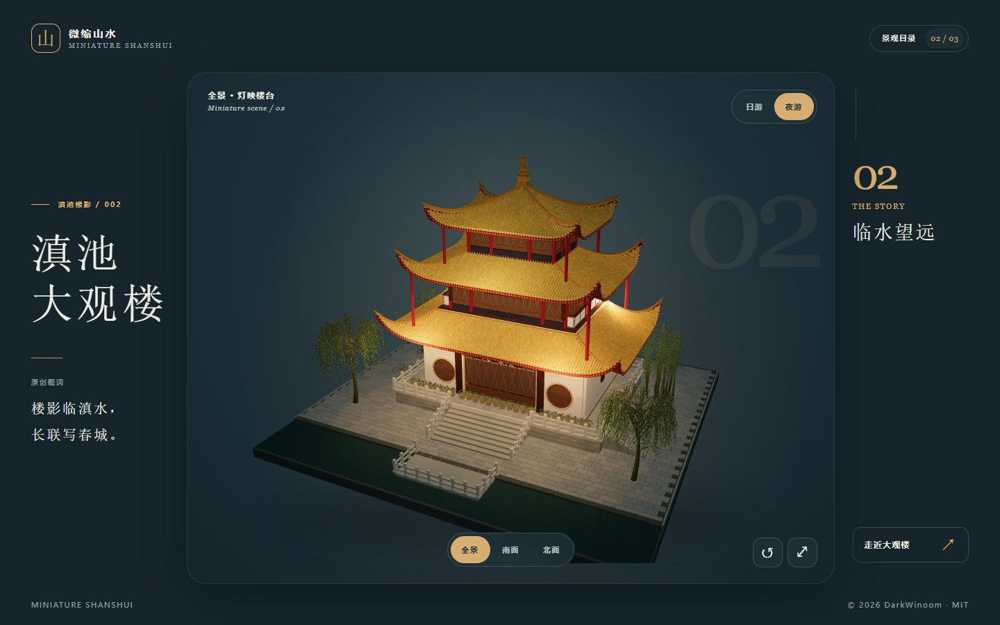
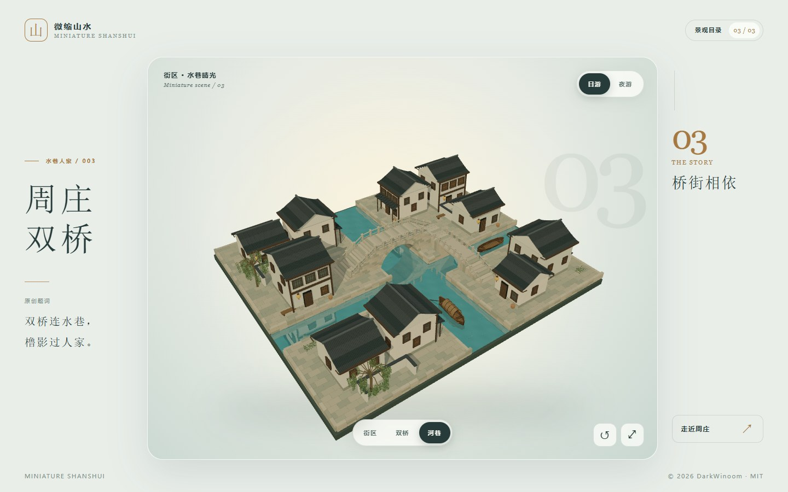
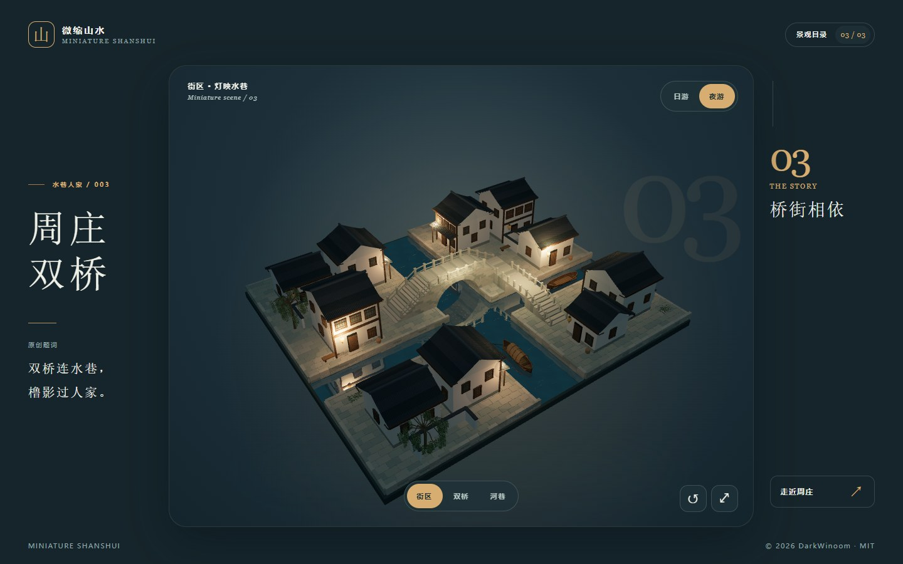

# 微缩山水 · Miniature ShanShui

从昆明的金马碧鸡坊与大观楼，到苏州的周庄双桥，在浏览器里转动一方微缩景观。项目是纯前端单页应用，无账号、后端或外部数据服务。

## 页面预览

| 01 · 金马碧鸡坊（日游） | 02 · 大观楼（夜游） |
| :---: | :---: |
|  |  |

| 03 · 周庄双桥（日游） | 03 · 周庄双桥（夜游） |
| :---: | :---: |
|  |  |

## 浏览与操作

- 在景观目录中切换金马碧鸡坊、大观楼与周庄双桥；每景都有自己的观看视角。拖动模型旋转，使用滚轮或双指缩放。
- 模型入场后会缓慢自动旋转，拖动后停转。展台右下角可以复位视角并重新开启自动旋转，也可以进入沉浸观景；按 `Esc` 可以退出沉浸模式。
- 切换“日游”“夜游”，查看柔和阳光与夜间灯光。点击当前景观的“走近”按钮阅读历史与掌故，点击“景观目录”查看已收录场景。
- 周庄双桥以石拱桥、石梁桥和十栋沿河民居组成微缩街区，提供“街区／双桥／河巷”三种视角。瓦片、砌石、木窗和船篷以几何细节呈现，水巷有缓慢波纹及随视角变化的桥影、民居与夜灯倒影。
- 模型载入时显示山水动画；若设备无法运行 WebGL 或模型加载失败，可以点“重新载入”重试，文字资料仍可阅读。启用系统的“减少动态效果”后，页面会简化切换动效。

目前收录 `01 · 金马碧鸡坊`、`02 · 大观楼`、`03 · 周庄双桥`。景观信息、目录封面、子视图、相机、灯光和水面效果统一登记在 `src/scenes.ts`，方便今后加入更多景观；目录只显示实际收录的场景。减少动态效果偏好下，周庄水纹停止运动，倒影仍可随观看视角更新。

## 本地运行

需要 Node.js 24 和 pnpm 11.19.0。下载仓库后，在项目根目录运行：

```sh
npm install --global pnpm@11.19.0
pnpm install --frozen-lockfile
pnpm dev
```

打开终端给出的本地地址。检查和构建生产文件：

```sh
pnpm check
pnpm build
pnpm preview
```

构建结果位于 `dist/`。也可以用 `npm install`、`npm run dev` 和 `npm run build`；仓库以 pnpm 锁文件作为可复现安装基准。

## 部署

运行 `pnpm build` 后，把 **`dist/` 内的全部文件** 放到任意静态网站服务的站点目录。资源使用相对路径，放在站点根目录或子目录均可。无需配置 API、数据库或服务端路由。直接双击本地 `index.html` 不适合加载模型，请通过静态服务器访问。

若使用 Docker，项目提供只构建前端并由 Nginx 提供静态文件的多阶段镜像：

```sh
docker build -t miniature-shanshui .
docker run --rm -p 8080:80 miniature-shanshui
```

然后访问 [http://localhost:8080](http://localhost:8080)。

## 内容与许可

项目代码、`public/models/` 的三个网页模型、`public/covers/` 的目录封面与本仓库页面截图，均按仓库根目录的 [MIT License](LICENSE) 开放。公开模型不含源 `.blend` 中从第三方实景照片裁切的贴图或描摹轮廓：金马碧鸡坊的题字与瑞兽改为独立绘制，大观楼的匾额和窗格为简化重绘。目录封面均从对应的清洁网页模型重新渲染；可编辑的源 `.blend` 和原预览图暂不公开。金马碧鸡坊简化题字使用 [霞鹜臻楷 GB](https://github.com/lxgw/LxgwZhenKai)，大观楼简化题字使用 [Ma Shan Zheng](https://github.com/googlefonts/mashanzheng)；两款字体依 SIL OFL 1.1 提供，字体文件未随项目分发。这些模型是微缩创作，并非文物测绘资料。

周庄双桥模型使用 Blender 5.2 制作，桥梁、民居、船只和植物均为原创几何与纯色材质，没有摄影贴图、第三方模型或外部法线图片。周边房屋与街巷为水乡风貌的概括创作。网页保留七级 Toon 建筑材质，单独为水巷加入自制波纹和场景反射；源文件、制作脚本及内部验证记录保存在被忽略的 `.agents-docs/`。

各景页面题词均为本项目原创；历史内容为原创概述，民间掌故明确标注。资料出处可在各景故事面板查看：金马碧鸡坊参阅[云南省民政厅地名文化资料](https://ynmz.yn.gov.cn/cms/dimingfengcai/11216.html)与[昆明信息港文史报道](https://m.kunming.cn/news/c/2023-01-16/13652377.shtml)，大观楼参阅[昆明历史建筑科普](https://www.kunming.cn/news/c/2026-04-22/14035565.shtml)与[大观楼文史报道](https://www.kunming.cn/news/c/2022-08-11/13585378.shtml)。周庄双桥参阅[周庄旅游官网](https://zhouzhuang.net/scenic_4/1257.html)、[昆山市人民政府](https://www.ks.gov.cn/kss/tsks/202112/e6157a6b261149879f8322af3980ee62.shtml)与[苏州市地方志资料](https://dfzb.suzhou.gov.cn/dfzb/szdq/201604/949ce3099ec640709af67935765015a8.shtml)。本项目不使用这些来源的图片或原文段落。

运行时使用的 Three.js 依其 MIT 许可分发，Draco 解码器依 Apache License 2.0 分发。项目 MIT 全文、第三方许可和告知文件随静态资源保存在 [`public/licenses/`](public/licenses/)，构建后也包含在 `dist/licenses/`。
